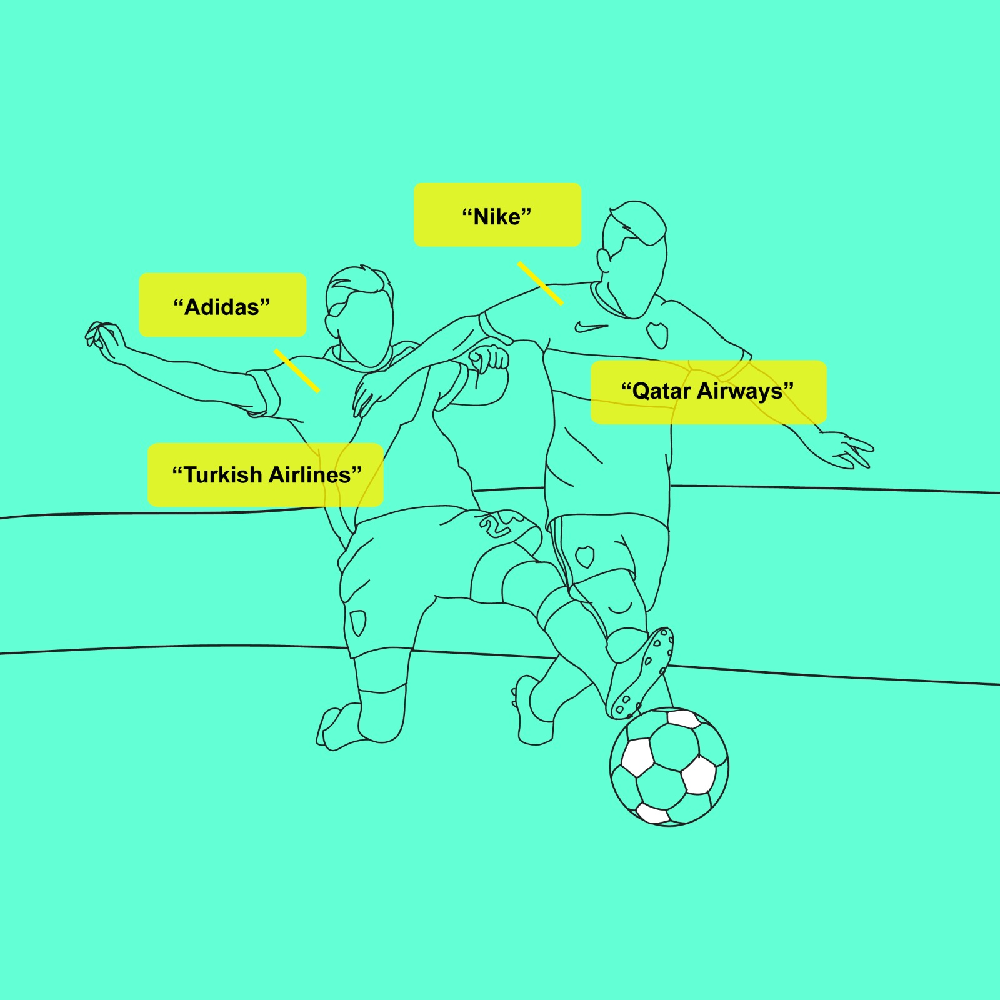

## Welcome to DeepLogo.ai ©

An early stage project to track brand logos in images and videos across the web. Measure brand visibility in social networks context and search the web for marketing highlights and brand safety. Companies spend millinos of dollars to track brand mentions but they ignore one powerful part of the message: the image. 

DeepLogo.ai uses computer vision technologies and advanced AI algorithms to detect logos in images and videos and to automate visual content discovery in social media.
 

  
   
  

## Usage

`$ pip install requirements`
`$ python pipeline.py`